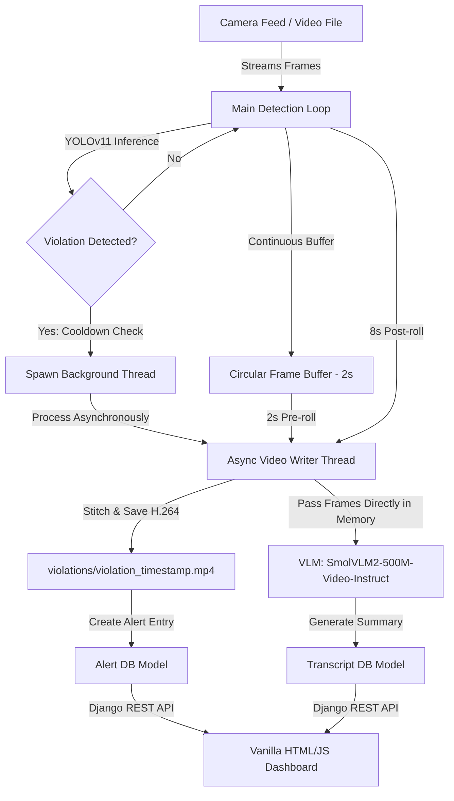
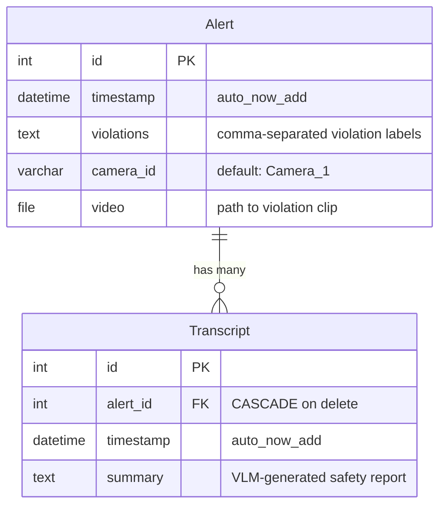
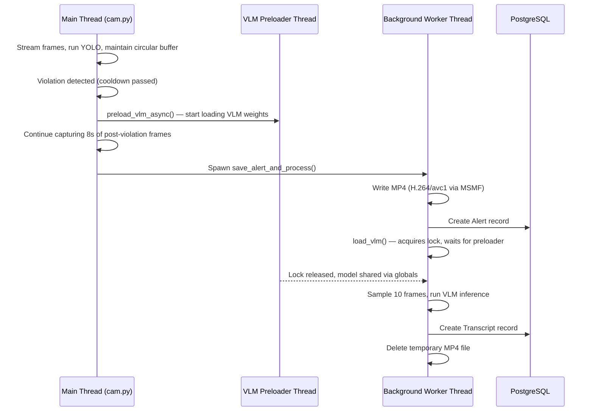
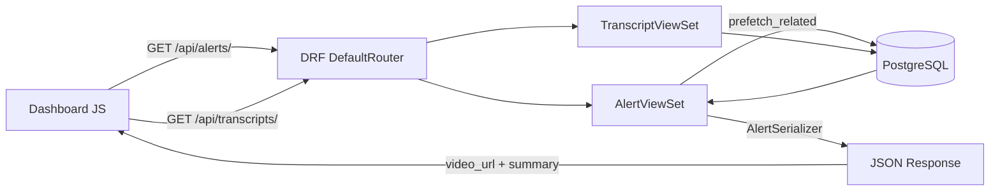

# Surveillance AI: System Architecture

This document explains the system design, component responsibilities, execution pipeline, and data flow of the Surveillance AI platform.

---

## System Overview

Surveillance AI is a real-time safety monitoring and compliance enforcement platform designed for industrial and construction environments. It operates as an intelligent pipeline that:

1. **Detects** safety compliance violations (e.g., workers without hardhats, vests, or masks) in real time using a custom fine-tuned YOLOv11 model.
2. **Records** violation clips asynchronously using a circular frame buffer (with a 2-second pre-roll and 8-second post-roll) to ensure the live video feed does not drop frames during disk writes.
3. **Summarizes** the incident chronologically using Hugging Face's SmolVLM2-500M-Video-Instruct Vision-Language Model (VLM) by processing sequential frame samples from the violation video.
4. **Delivers** alerts and AI-generated descriptions to safety managers via a Django-based REST API and a web dashboard.

---

## Technical Stack

| Layer | Technology |
|---|---|
| Web Framework | Django 5.2 (Python) |
| API Development | Django REST Framework (DRF) |
| Database | PostgreSQL (local instance `ai_alerts_db`) |
| Object Detection | Ultralytics YOLOv11 (custom model weights `best.pt`) |
| Vision-Language Model | PyTorch, Hugging Face Transformers (`HuggingFaceTB/SmolVLM2-500M-Video-Instruct`) |
| Video/Image Processing | OpenCV (OpenCV-Python), Pillow (PIL) |
| Asynchronous Execution | Native Python threading |
| Frontend | HTML5, Vanilla CSS3 (with custom CSS variables), Vanilla JavaScript (async/fetch API) |
| Dependencies | `num2words` (required by the SmolVLM processor) |

---

## Project Structure and File Roles

```text
ai_alerts/
├── manage.py                  # Django project manager CLI
├── alertsite/                 # Project-level Django configuration folder (settings, urls)
├── templates/                 # HTML Templates directory (dashboard.html)
├── static/                    # Static assets
│   ├── css/styles.css         # Dashboard custom styles
│   └── js/scripts.js          # Polling and DOM manipulation scripts
├── models/                    # YOLO model weights and helper files (best.pt)
├── demo_video/                # Sample video clips for demonstration
├── violations/                # Local media folder where violation clips are saved (ignored by git)
└── alerts/                    # Main Django App
    ├── models.py              # Alert and Transcript Database Schemas
    ├── serializers.py         # DRF Serializers for API communication
    ├── views.py               # Dashboard Views and DRF ViewSets
    └── scripts/
        ├── cam.py             # Main multithreaded YOLOv11 camera processing runner
        └── transcript.py      # VLM Integration and Summary generation script
```

---

## Component Responsibilities

### `alerts/scripts/cam.py` — Detection & Recording Engine
- Streams video frames from a live camera or video file via OpenCV.
- Maintains a circular frame buffer (`collections.deque`) for 2-second pre-roll.
- Runs YOLOv11 inference on each frame and checks for violation classes.
- Manages alert cooldowns (15 seconds) to prevent duplicate alerts.
- Spawns background threads for video saving and VLM processing.
- Handles graceful shutdown with `try...finally` to preserve partial recordings.

### `alerts/scripts/transcript.py` — VLM Summary Generator
- Lazily loads the SmolVLM2-500M-Video-Instruct model with double-checked locking.
- Supports concurrent preloading via `preload_vlm_async()`.
- Samples 10 evenly spaced frames from the violation clip.
- Generates concise safety reports grounded with YOLO-detected violation categories.
- Uses repetition-prevention parameters (greedy decoding, repetition penalty, n-gram blocking).

### `alerts/models.py` — Database Models
- Defines the `Alert` and `Transcript` ORM models (see Database Schema below).

### `alerts/serializers.py` — API Serialization
- `AlertSerializer`: Includes computed `video_url` and `summary` fields. The `summary` field fetches the associated transcript in-memory using the prefetch cache.
- `TranscriptSerializer`: Standard model serializer for `Transcript`.

### `alerts/views.py` — API & UI Controllers
- `AlertViewSet`: DRF ModelViewSet with `prefetch_related("transcript_set")` to avoid N+1 queries.
- `TranscriptViewSet`: DRF ModelViewSet for direct transcript access.
- `dashboard()`: Renders the HTML dashboard template.

### `alertsite/` — Django Project Configuration
- `settings.py`: Database, static files, media, and installed apps configuration.
- `urls.py`: Root URL routing, delegates to `alerts/urls.py`.

---

## Execution Pipeline



### Step-by-Step Pipeline

#### 1. Real-time Stream Detection & Circular Buffering
OpenCV streams incoming camera frames in the main execution thread. The frames are continually stored in a circular queue (`collections.deque` with `pre_roll_seconds = 2`) to maintain a sliding history of the last 2 seconds of footage (pre-roll). YOLOv11s runs object detection on each frame to identify violation classes (`NO-Hardhat`, `NO-Safety Vest`, `NO-Mask`).

#### 2. Alert Triggering & Cooldown Control
Once a violation is detected, a 15-second cooldown is enforced. This cooldown prevents the system from triggering duplicate, overlapping alerts for a single continuous violation, which would flood the database and safety manager dashboard.

#### 3. Asynchronous Multi-Threaded Logging
To prevent disk writing and VLM weight loading from blocking the main webcam/video feed thread (which would freeze the live preview window and cause frame drops), a background worker thread is spawned. The thread extracts the 2-second pre-roll from the circular buffer and records the next 8 seconds of post-violation frames to compile a complete 10-second compliance clip. To ensure the recorded MP4 video is natively playable in web browsers without requiring CPU-heavy format transcoding, the video writer utilizes the H.264 ('avc1') codec with the Microsoft Media Foundation (`cv2.CAP_MSMF`) backend on Windows.

#### 4. Disconnect Backup (Try-Finally)
The camera stream loop is wrapped in a `try...finally` block. If the camera cuts off, the feed gets disconnected, or the user manually exits the script (using the `q` key or `Ctrl+C`) while a violation is being buffered, the system intercepts the exit event. The `finally` block captures any remaining frames in the active buffer and processes them synchronously before the program terminates, guaranteeing that no compliance alerts are lost.

#### 5. Concurrent VLM Preloading
To minimize processing latency after a video finishes recording, a background thread initiates the VLM weight loading pipeline (`preload_vlm_async`) concurrently while the camera is still capturing the remaining 8 seconds of the clip. A double-checked `threading.Lock` coordinates the preloader and the saver threads to prevent concurrent loads of the weights, avoiding memory duplication and CPU crashes.

#### 6. In-Memory Frame Transcription
The background thread passes the captured frames list directly from RAM to the VLM transcription function. This eliminates the traditional pipeline's redundant disk write-then-read cycle (saving video to disk, opening a video capture stream, decoding and reading frames back), bypassing disk I/O bottlenecks and reducing overall CPU transcription processing delay.

#### 7. Repetition-Resistant VLM Incident Reporting
The VLM processor samples 10 evenly spaced frames directly from memory (approx. 1 frame/second for a 10s video) and runs inference using `HuggingFaceTB/SmolVLM2-500M-Video-Instruct`. Small models (500M parameters) are highly susceptible to repeating words or generating contradictory sentences. To resolve this, decoding constraints are specified in `generate()`: greedy decoding (`do_sample=False`), a repetition penalty (`repetition_penalty=1.2`), and an n-gram blocker (`no_repeat_ngram_size=3`) to strictly block repetitive text generation loops and produce cohesive safety reports.

---

## Database Schema

The application uses PostgreSQL with two tables linked by a foreign key:



### Alert Model
Represents a recorded safety violation event.
- **`timestamp`** (`DateTimeField`): Automatic timestamp of when the violation occurred.
- **`violations`** (`TextField`): A comma-separated string storing the violation categories detected (e.g. `"NO-Hardhat, NO-Safety Vest"`).
- **`camera_id`** (`CharField`): Identifier for the originating stream (default: `"Camera_1"`).
- **`video`** (`FileField`): File path pointing to the saved video file in `violations/`.

### Transcript Model
Holds the AI-generated descriptive summary of the violation event.
- **`alert`** (`ForeignKey` → `Alert`, `on_delete=CASCADE`): One-to-many relationship mapping the description back to the safety alert.
- **`timestamp`** (`DateTimeField`): Time of summary creation.
- **`summary`** (`TextField`): Text summary of the event generated by the VLM.

---

## Threading Model

The system uses three categories of threads:



| Thread | Role | Blocking Behavior |
|---|---|---|
| **Main Thread** | Streams frames, runs YOLO, maintains buffer, renders live preview | Never blocked by I/O or VLM |
| **VLM Preloader** | Starts loading SmolVLM2 weights as soon as a violation triggers | Daemon thread; acquires `_load_lock` |
| **Background Worker** | Writes video, creates DB records, runs VLM inference | Waits on `_load_lock` if preloader is still loading |

---

## API Flow



### Endpoints

| Endpoint | Method | Description |
|---|---|---|
| `/api/alerts/` | GET | Returns all violation alerts with timestamps, camera IDs, video URLs, and AI summaries |
| `/api/alerts/{id}/` | GET | Returns a single alert by ID |
| `/api/transcripts/` | GET | Returns all transcripts (alert ID → summary mapping) |
| `/` | GET | Renders the HTML management dashboard |

### Query Optimization
The `AlertViewSet` uses `prefetch_related("transcript_set")` and the serializer reads from the prefetch cache via `obj.transcript_set.all()` (not `.first()`), reducing query count from N+1 to exactly 2 queries regardless of result size.

---

## Optimization Decisions

| Optimization | Impact |
|---|---|
| **Lazy VLM Loading** | Prevents ~2GB model load from blocking Django startup (migrations, runserver, tests) |
| **Double-Checked Locking** | Prevents concurrent VLM loads from doubling RAM usage and crashing CPU |
| **In-Memory Frame Pipeline** | Eliminates disk write → read cycle for VLM input, cutting I/O latency |
| **VLM Preloading** | Overlaps model loading with 8s frame capture, hiding load time |
| **Frame Sampling (10 frames)** | Reduces CPU tensor computation by ~40% vs. 16 frames while maintaining temporal coverage |
| **Prefetch Cache** | Drops DB queries from N+1 to 2 for the alerts list endpoint |
| **H.264 via MSMF** | Uses native Windows encoder, avoiding FFMPEG DLL dependency issues |
| **15s Cooldown** | Prevents duplicate alerts for continuous violations |
| **Temporary File Cleanup** | Deletes the OpenCV-written MP4 after Django copies it to `MEDIA_ROOT` |
| **Repetition Penalty + N-gram Block** | Prevents small VLM (500M params) from generating looping/contradictory text |
