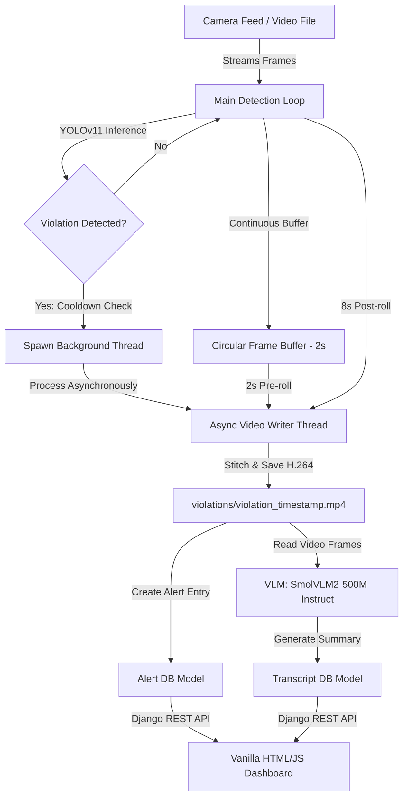

# Surveillance AI: Real-Time Safety Violation Detection and AI Review Dashboard

Surveillance AI is a safety monitoring and compliance enforcement platform designed for industrial and construction environments. It integrates YOLOv11 object detection to detect Personal Protective Equipment (PPE) compliance violations, uses a multithreaded frame buffer to record violation clips asynchronously, and leverages a Vision-Language Model (VLM) to automatically write summaries of safety incidents. The captured violations and AI-generated event reports are served to safety managers through a modern, responsive web dashboard.

---

## Core Features

- **YOLOv11 Detection Pipeline**: Fine-tuned YOLOv11 model detecting safety equipment compliance in real time, focusing on violations such as missing helmets (NO-Hardhat), missing vests (NO-Safety Vest), and missing masks (NO-Mask).
- **Asynchronous Video Logger**: Uses a circular frame buffer (storing a 2-second pre-roll) and spawns background worker threads upon violation detection to write 10-second violation clips in MP4 format using the H.264 codec (avc1), ensuring the live camera feed never drops frames during disk writes.
- **AI-Powered Event Transcripts**: Integrates Hugging Face's SmolVLM2-500M-Instruct Vision-Language Model (VLM) to analyze violation videos as a sequence of frames and generate chronological event summaries.
- **RESTful API**: Clean API endpoints powered by Django REST Framework (/api/alerts/ and /api/transcripts/).
- **Management Dashboard**: Web-based interface with a list-detail view, live search, embedded video player, and details on violation timestamps, camera source, and AI summaries.

---

## Architecture and Workflow



### Detailed Pipeline

1. **Detection and Buffering**: OpenCV streams video frames into a circular deque representing a 2-second history. The main thread runs YOLOv11 on each frame.
2. **Asynchronous Spawning**: When a compliance violation is detected, a background thread is spawned to avoid locking the main display. This background thread takes the 2-second pre-roll from the queue and captures the next 8 seconds of frames to construct a 10-second record.
3. **Database and File Storage**: The video is written using the H.264 codec, saved to disk, and registered as a Django Alert model object.
4. **VLM Chronological Analysis**: The system samples 16 frames from the saved video and sends them to the local SmolVLM2-500M-Instruct model. The model analyzes the sequence of frames and generates a chronological description, which is saved in the database as a Transcript model object.

---

## Project Structure

```
ai_alerts/
├── manage.py                  # Django project manager
├── alertsite/                 # Django core configuration folder (settings, urls)
├── templates/                 # HTML Templates (dashboard.html)
├── static/                    # Static assets (css/styles.css, js/scripts.js)
├── models/                    # YOLO model weights and helper files (best.pt)
├── demo_video/                # Sample video clips for demonstration
├── violations/                # Local media folder where violation clips are saved (ignored by git)
└── alerts/                    # Main Django App
    ├── models.py              # Alert and Transcript Database Schemas
    ├── serializers.py         # DRF Serializers for API communication
    ├── views.py               # Dashboard Views and DRF ViewSets
    ├── transcript.py          # VLM Integration and Summary generation script
    └── scripts/
        └── cam.py             # Main multithreaded YOLOv11 video processing script
```

---

## Prerequisites and Setup

### 1. Database Setup
The application uses PostgreSQL as its primary database. Update your local credentials in `ai_alerts/alertsite/settings.py` if they differ:
```python
DATABASES = {
    'default': {
        'ENGINE': 'django.db.backends.postgresql',
        'NAME': 'ai_alerts_db',
        'USER': 'postgres',
        'PASSWORD': '<YOUR_PASSWORD>',
        'HOST': 'localhost',
        'PORT': '5432',
    }
}
```

### 2. Dependency Installation
Ensure Python 3.10+ is installed. Inside your virtual environment, install the required dependencies:
```bash
pip install django djangorestframework django-extensions ultralytics opencv-python torch transformers pillow psycopg2-binary num2words
```

### 3. Initialize Django App and Run Migrations
Generate the database schema and migrate:
```bash
cd ai_alerts
python manage.py makemigrations
python manage.py migrate
```

---

## Running the Platform

To run the full platform, you need to run the Surveillance Stream (YOLO detector) and the Django Web Server simultaneously.

### 1. Run the Detection Stream
Use the Django Extensions `runscript` utility to execute the camera/video processing script in the context of the Django project:
```bash
# In the ai_alerts directory:
python manage.py runscript cam
```
Press `q` to quit the live OpenCV camera view window.

### 2. Run the Web Server
Launch the Django server in a separate terminal:
```bash
# In the ai_alerts directory:
python manage.py runserver
```
Navigate to `http://127.0.0.1:8000/` in your web browser to access the management dashboard.

---

## Future Enhancements
- **Multi-Camera Feeds**: Support for processing multiple RTSP streams simultaneously.
- **SMS/Slack/Email Alerts**: Automated notifications dispatched to site managers instantly when a safety violation is recorded.
- **Edge Deployment Optimization**: Optimize YOLOv11 inference speed using TensorRT or OpenVINO.
- **Interactive VLM Chat**: Enable safety managers to ask specific questions about the recorded video clip directly on the dashboard (e.g., "Was the worker carrying tools?").
