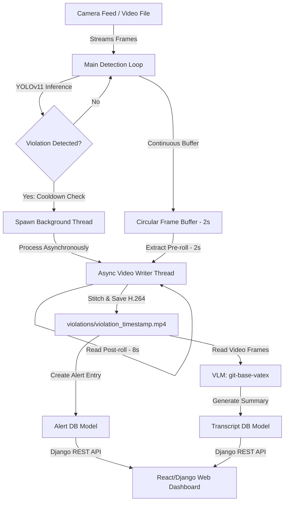

# 🚧 Surveillance AI: Real-Time Safety Violation Detection & AI Review Dashboard

Surveillance AI is a complete safety monitoring and compliance enforcement platform designed for industrial and construction environments. It integrates **YOLOv11 object detection** to detect Personal Protective Equipment (PPE) compliance violations, uses a **multithreaded frame buffer** to record violation clips asynchronously, and leverages a **Vision Language Model (VLM)** to automatically write summaries of safety incidents. The captured violations and AI-generated event reports are served to safety managers through a modern, responsive web dashboard.

---

## ⚡ Core Features

- **YOLOv11 Detection Pipeline**: Fine-tuned YOLOv11 model detecting safety equipment compliance in real time (`Hardhat`, `Safety Vest`, `Mask`, `Safety Cone`, `Machinery`, `Vehicle`, `Person`).
- **Asynchronous Video Logger**: Uses a circular frame buffer (storing a 2-second pre-roll) and spawns background worker threads upon violation detection to write 10-second violation clips (`.mp4` format using H.264 codec), ensuring the live camera feed never drops frames.
- **AI-Powered Event Transcripts**: Integrates Hugging Face's `microsoft/git-base-vatex` Vision-Language Model (VLM) to analyze violation videos frame-by-frame and generate textual event summaries.
- **RESTful API**: Clean API endpoints powered by **Django REST Framework** (`/api/alerts/` & `/api/transcripts/`).
- **Modern Management Dashboard**: Clean web-based interface with a list-detail view, live search, embedded video player, and details on violation timestamps, camera source, and AI summaries.

---

## 🏗️ Architecture & Workflow



---

## 📂 Project Structure

```
SurveillanceAi/
├── data.yaml                  # YOLOv11 dataset class mappings & train/val/test paths
├── yolo11n.pt / yolo11s.pt   # Pretrained YOLOv11 base weights
├── dataset/                   # Dataset directory structure (images, labels)
├── runs/                      # YOLO training runs and custom fine-tuned weights
└── ai_alerts/                 # Django Web Application Root
    ├── manage.py              # Django project manager
    ├── alertsite/             # Django core configuration folder (settings, urls)
    ├── templates/             # HTML Templates (dashboard.html)
    ├── static/                # Static assets (css/styles.css, js/scripts.js)
    ├── violations/            # Media folder where violation MP4 files are stored
    └── alerts/                # Main Django App
        ├── models.py          # Alert & Transcript Database Schemas
        ├── serializers.py     # DRF Serializers for API communication
        ├── views.py           # Dashboard Views & DRF ViewSets
        ├── transcript.py      # VLM Integration & Summary generation script
        └── scripts/
            └── cam.py         # Main multithreaded YOLOv11 video processing script
```

---

## 🛠️ Prerequisites & Setup

### 1. Database Setup
The application uses **PostgreSQL** as its primary database. Update your local credentials in `ai_alerts/alertsite/settings.py` if they differ:
```python
DATABASES = {
    'default': {
        'ENGINE': 'django.db.backends.postgresql',
        'NAME': 'ai_alerts_db',
        'USER': 'postgres',
        'PASSWORD': '<YOUR_PASSWORD>',
        'HOST': 'localhost',
        'PORT': '5432',
    }
}
```

### 2. Dependency Installation
Ensure Python 3.10+ is installed. Inside the `ai_alerts` virtual environment or your global system, install dependencies:
```bash
pip install django djangorestframework django-extensions ultralytics opencv-python torch transformers pillow psycopg2-binary
```

### 3. Initialize Django App & Run Migrations
Generate the database schema and migrate:
```bash
cd ai_alerts
python manage.py makemigrations
python manage.py migrate
```

---

## 🚀 Running the Platform

To run the full platform, you need to run the **Surveillance Stream** (YOLO detector) and the **Django Web Server** simultaneously.

### 1. Run the Detection Stream
Use the Django Extensions `runscript` utility to execute the camera/video processing script in the context of the Django project:
```bash
# In the ai_alerts directory:
python manage.py runscript cam
```
*Press `q` to quit the live OpenCV camera view window.*

### 2. Run the Web Server
Launch the Django server in a separate terminal:
```bash
# In the ai_alerts directory:
python manage.py runserver
```
Navigate to `http://127.0.0.1:8000/` in your web browser to access the management dashboard.

---

## 🔮 Future Enhancements
- **Multi-Camera Feeds**: Support for processing multiple RTSP streams simultaneously.
- **SMS/Slack/Email Alerts**: Automated notifications dispatched to site managers instantly when a safety violation is recorded.
- **Edge Deployment Optimization**: Optimize YOLOv11 inference speed using TensorRT or OpenVINO.
- **Interactive VLM Chat**: Enable safety managers to ask specific questions about the recorded video clip directly on the dashboard (e.g., *"Was the worker carrying tools?"*).
