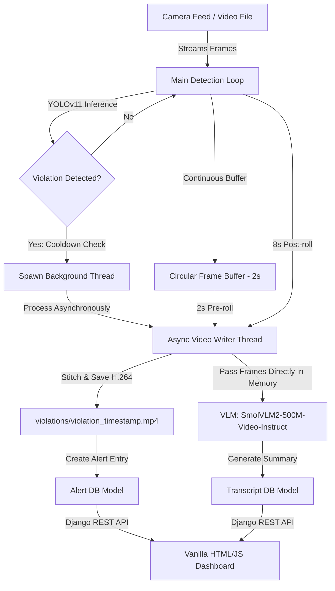

# Surveillance AI: Real-Time Safety Violation Detection and AI Review Dashboard

Surveillance AI is a safety monitoring and compliance enforcement platform designed for industrial and construction environments. It integrates YOLOv11 object detection to detect Personal Protective Equipment (PPE) compliance violations, uses a multithreaded frame buffer to record violation clips asynchronously, and leverages a Vision-Language Model (VLM) to automatically write summaries of safety incidents. The captured violations and AI-generated event reports are served to safety managers through a modern, responsive web dashboard.

---

## Core Features

- **YOLOv11 Detection Pipeline**: Fine-tuned YOLOv11 model detecting safety equipment compliance in real time, focusing on violations such as missing helmets (NO-Hardhat), missing vests (NO-Safety Vest), and missing masks (NO-Mask).
- **Asynchronous Video Logger**: Uses a circular frame buffer (storing a 2-second pre-roll) and spawns background worker threads upon violation detection to write 10-second violation clips in MP4 format using the H.264 codec (avc1), ensuring the live camera feed never drops frames during disk writes.
- **AI-Powered Event Transcripts**: Integrates Hugging Face's SmolVLM2-500M-Video-Instruct Vision-Language Model (VLM) to analyze violation videos as a sequence of frames and generate chronological event summaries.
- **RESTful API**: Clean API endpoints powered by Django REST Framework (/api/alerts/ and /api/transcripts/).
- **Management Dashboard**: Web-based interface with a list-detail view, live search, embedded video player, and details on violation timestamps, camera source, and AI summaries.

---

## Architecture and Workflow



### Detailed Pipeline

1. **Real-time Stream YOLOv11s Detection & Circular Buffering**:
   OpenCV streams incoming camera frames in the main execution thread. The frames are continually stored in a circular queue (`collections.deque` with `pre_roll_seconds = 2`) to maintain a sliding history of the last 2 seconds of footage (pre-roll). YOLOv11s runs object detection on each frame to identify violation classes (`NO-Hardhat`, `NO-Safety Vest`, `NO-Mask`).
2. **Alert Triggering & Cooldown Control**:
   Once a violation is detected, a 15-second cooldown is enforced. This cooldown prevents the system from triggering duplicate, overlapping alerts for a single continuous violation, which would flood the database and safety manager dashboard.
3. **Asynchronous Multi-Threaded Logging**:
   To prevent disk writing and VLM weight loading from blocking the main webcam/video feed thread (which would freeze the live preview window and cause frame drops), a background worker thread is spawned. The thread extracts the 2-second pre-roll from the circular buffer and records the next 8 seconds of post-violation frames to compile a complete 10-second compliance clip. To ensure the recorded MP4 video is natively playable in web browsers without requiring CPU-heavy format transcoding, the video writer utilizes the H.264 ('avc1') codec with the Microsoft Media Foundation (`cv2.CAP_MSMF`) backend on Windows.

   > **macOS / Linux Note:** The `cv2.CAP_MSMF` backend is Windows-only. On macOS or Linux, update the `VideoWriter` call in `cam.py` to remove the MSMF backend parameter (OpenCV will use FFMPEG by default):
   > ```python
   > out = cv2.VideoWriter(filepath, fourcc, fps, frame_size)
   > ```
4. **Try-Finally Disconnect Backup**:
   The camera stream loop is wrapped in a `try...finally` block. If the camera cuts off, the feed gets disconnected, or the user manually exits the script (using the `q` key or `Ctrl+C`) while a violation is being buffered, the system intercepts the exit event. The `finally` block captures any remaining frames in the active buffer and processes them synchronously before the program terminates, guaranteeing that no compliance alerts are lost.
5. **Concurrent VLM Preloading**:
   To minimize processing latency after a video finishes recording, a background thread initiates the VLM weight loading pipeline (`preload_vlm_async`) concurrently while the camera is still capturing the remaining 8 seconds of the clip. A double-checked `threading.Lock` coordinates the preloader and the saver threads to prevent concurrent loads of the weights, avoiding memory duplication and CPU crashes.
6. **In-Memory Frame Transcription Pipeline**:
   The background thread passes the captured frames list directly from RAM to the VLM transcription function. This eliminates the traditional pipeline's redundant disk write-then-read cycle (saving video to disk, opening a video capture stream, decoding and reading frames back), bypassing disk I/O bottlenecks and reducing overall CPU transcription processing delay.
7. **Repetition-Resistant VLM Incident Reporting**:
   The VLM processor samples 10 evenly spaced frames directly from memory (approx. 1 frame/second for a 10s video) and runs inference using `HuggingFaceTB/SmolVLM2-500M-Video-Instruct`. Small models (500M parameters) are highly susceptible to repeating words or generating contradictory sentences. To resolve this, decoding constraints are specified in `generate()`: greedy decoding (`do_sample=False`), a repetition penalty (`repetition_penalty=1.2`), and an n-gram blocker (`no_repeat_ngram_size=3`) to strictly block repetitive text generation loops and produce cohesive safety reports.

---

## YOLOv11s Custom Model Training Statistics

The custom safety equipment detector was fine-tuned on a custom safety compliance dataset. Key evaluation metrics achieved during testing:

- **Precision (B)**: **92.3%** (high precision ensures minimal false alarms)
- **Recall (B)**: **76.8%** (captures the vast majority of safety incidents)
- **mAP50 (B)**: **84.7%** (Mean Average Precision at 0.5 IoU threshold)
- **mAP50-95 (B)**: **56.7%** (standard COCO benchmark metric)
- **Training Configuration**: Input resolution 640x640, batch size 12, closed mosaic augmentations for the final training phase.

---

## Hardware Requirements & Core Resource Management

Because the project runs the AI models locally, the computational pipeline is optimized for edge/CPU devices:

- **YOLOv11s (Small)**: Custom weights file size is **~19MB**, requiring ~0.15s per frame inference on standard modern CPUs. Can be scaled/upgraded to YOLOv11m or YOLOv11l as needed.
- **SmolVLM2-500M-Video-Instruct**: Downloaded model cache directory on disk takes **1.8-2.0GB**. During execution, the model requires approximately **1.8GB - 2.0GB of RAM** for video inference on CPU.
- **Total Local Footprint**: The combined system (Django, YOLOv11s, and SmolVLM2) runs comfortably on a standard local CPU machine with 8GB of RAM without requiring dedicated NVIDIA GPU accelerators.
- **Inference Latency Compensation**: Frame sampling is set to 10 frames (via `NUM_SAMPLES = 10` in `transcript.py`), cutting tensor calculation time on CPU by over 40% compared to standard 16-frame analysis.
- **Model Scalability**:
  - _Detector_: The base architecture can be upgraded to YOLOv11m (~40MB) or YOLOv11l (~80MB) in `cam.py` if higher detection precision is required.
  - _VLM_: The summary generator can be upgraded to `SmolVLM2-2.2B-Instruct` (~5GB RAM) for more complex safety reports.

---

## Project Structure

```
ai_alerts/
├── manage.py                  # Django project manager
├── alertsite/                 # Django core configuration folder (settings, urls)
├── templates/                 # HTML Templates (dashboard.html)
├── static/                    # Static assets (css/styles.css, js/scripts.js)
├── models/                    # YOLO model weights and helper files (best.pt)
├── demo_video/                # Sample video clips for demonstration
├── violations/                # Local media folder where violation clips are saved (ignored by git)
└── alerts/                    # Main Django App
    ├── models.py              # Alert and Transcript Database Schemas
    ├── serializers.py         # DRF Serializers for API communication
    ├── views.py               # Dashboard Views and DRF ViewSets
    └── scripts/
        ├── cam.py             # Main multithreaded YOLOv11 video processing script
        └── transcript.py      # VLM Integration and Summary generation script
```

---

## Prerequisites and Setup

### 1. Clone the Repository

```bash
git clone https://github.com/RananJ/SurveillanceAi.git
cd SurveillanceAi
```

### 2. Create and Activate a Virtual Environment

**Windows (PowerShell):**
```powershell
python -m venv ai_alerts/.venv
ai_alerts\.venv\Scripts\activate
```

**macOS / Linux:**
```bash
python3 -m venv ai_alerts/.venv
source ai_alerts/.venv/bin/activate
```

### 3. Install PostgreSQL

The project uses PostgreSQL as its database backend.

**Windows:**
Download and install from [postgresql.org/download/windows](https://www.postgresql.org/download/windows/). The installer includes pgAdmin and sets up the `postgres` superuser.

**macOS (Homebrew):**
```bash
brew install postgresql@15
brew services start postgresql@15
createuser -s postgres
```

**Linux (Debian/Ubuntu):**
```bash
sudo apt update
sudo apt install postgresql postgresql-contrib
sudo systemctl start postgresql
sudo systemctl enable postgresql
```

**Linux (Fedora/RHEL):**
```bash
sudo dnf install postgresql-server postgresql-contrib
sudo postgresql-setup --initdb
sudo systemctl start postgresql
sudo systemctl enable postgresql
```

After installation, create the project database on all platforms:
```bash
psql -U postgres -c "CREATE DATABASE ai_alerts_db;"
```

### 4. Configure Database and Secret Key

Edit `ai_alerts/alertsite/settings.py` with your PostgreSQL credentials:

```python
SECRET_KEY = 'your_secret_key'

DATABASES = {
    'default': {
        'ENGINE': 'django.db.backends.postgresql',
        'NAME': 'ai_alerts_db',
        'USER': 'postgres',
        'PASSWORD': 'your_postgres_password',
        'HOST': 'localhost',
        'PORT': '5432',
    }
}
```

### 5. Install Python Dependencies

Ensure Python 3.10+ is installed. With the virtual environment activated:

**Windows:**
```powershell
pip install django djangorestframework django-extensions ultralytics opencv-python torch transformers pillow psycopg2-binary num2words
```

**macOS / Linux:**
```bash
pip install django djangorestframework django-extensions ultralytics opencv-python torch transformers pillow psycopg2-binary num2words
```

> **Note (macOS):** If `psycopg2-binary` fails to install, you may need to install PostgreSQL headers first: `brew install libpq` and then `pip install psycopg2-binary`.

> **Note (Linux):** If `psycopg2-binary` fails, install the build dependencies: `sudo apt install libpq-dev python3-dev` (Debian/Ubuntu) or `sudo dnf install libpq-devel python3-devel` (Fedora/RHEL), then retry.

### 6. Initialize Django App and Run Migrations

```bash
cd ai_alerts
python manage.py makemigrations
python manage.py migrate
```

---

## Running the Platform

To run the full platform, you need to run the Surveillance Stream (YOLO detector) and the Django Web Server simultaneously.

### 1. Run the Detection Stream

Use the Django Extensions `runscript` utility to execute the camera/video processing script in the context of the Django project:

```bash
# In the ai_alerts directory:
python manage.py runscript cam
```

Press `q` to quit the live OpenCV camera view window.

### 2. Run the Web Server

Launch the Django server in a separate terminal:

```bash
# In the ai_alerts directory:
python manage.py runserver
```

Navigate to `http://127.0.0.1:8000/` in your web browser to access the management dashboard.

---

## Future Enhancements

- **Multi-Camera Feeds**: Support for processing multiple RTSP streams simultaneously.
- **SMS/Slack/Email Alerts**: Automated notifications dispatched to site managers instantly when a safety violation is recorded.
- **Edge Deployment Optimization**: Optimize YOLOv11 inference speed using TensorRT or OpenVINO.
- **Interactive VLM Chat**: Enable safety managers to ask specific questions about the recorded video clip directly on the dashboard (e.g., "Was the worker carrying tools?").
