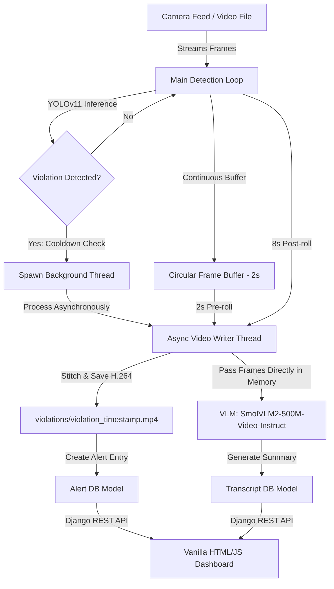

# Surveillance AI: Real-Time Safety Violation Detection and AI Review Dashboard

Surveillance AI is a safety monitoring and compliance enforcement platform designed for industrial and construction environments. It integrates YOLOv11 object detection to detect Personal Protective Equipment (PPE) compliance violations, uses a multithreaded frame buffer to record violation clips asynchronously, and leverages a Vision-Language Model (VLM) to automatically write summaries of safety incidents. The captured violations and AI-generated event reports are served to safety managers through a modern, responsive web dashboard.

---

## Features

- **YOLOv11 Detection Pipeline**: Fine-tuned YOLOv11 model detecting safety equipment compliance in real time, focusing on violations such as missing helmets (NO-Hardhat), missing vests (NO-Safety Vest), and missing masks (NO-Mask).
- **Asynchronous Video Logger**: Uses a circular frame buffer (storing a 2-second pre-roll) and spawns background worker threads upon violation detection to write 10-second violation clips in MP4 format using the H.264 codec (avc1), ensuring the live camera feed never drops frames during disk writes.
- **AI-Powered Event Transcripts**: Integrates Hugging Face's SmolVLM2-500M-Video-Instruct Vision-Language Model (VLM) to analyze violation videos as a sequence of frames and generate chronological event summaries.
- **RESTful API**: Clean API endpoints powered by Django REST Framework (`/api/alerts/` and `/api/transcripts/`).
- **Management Dashboard**: Web-based interface with a list-detail view, live search, embedded video player, and details on violation timestamps, camera source, and AI summaries.

---

## Architecture



For detailed component responsibilities, threading model, database schemas, and data flow, see [ARCHITECTURE.md](ARCHITECTURE.md).

---

## Technology Stack

| Layer | Technology |
|---|---|
| Web Framework | Django 5.2 (Python) |
| API | Django REST Framework |
| Database | PostgreSQL |
| Object Detection | Ultralytics YOLOv11s (custom fine-tuned weights) |
| Vision-Language Model | Hugging Face SmolVLM2-500M-Video-Instruct |
| Video Processing | OpenCV, Pillow |
| Concurrency | Python threading |
| Frontend | HTML5, Vanilla CSS3, Vanilla JavaScript |

---

## Pipeline

1. **Detection & Buffering**: OpenCV streams camera frames. YOLOv11s runs inference on each frame. A circular buffer (`collections.deque`) maintains a 2-second pre-roll history.
2. **Alert Triggering**: When a violation is detected and the 15-second cooldown has elapsed, the system captures the pre-roll and begins recording 8 seconds of post-violation footage.
3. **Async Recording**: A background thread stitches the 10-second clip into an H.264 MP4, saves it to the database, and cleans up the temporary file.
4. **VLM Transcription**: The background thread passes the captured frames directly from memory to SmolVLM2, which generates a concise safety report. The VLM is preloaded concurrently during the recording phase to minimize latency.
5. **Dashboard Delivery**: Django REST Framework serves alerts and transcripts via `/api/alerts/`. The frontend fetches and renders them in a responsive dashboard.

---

## Project Structure

```
ai_alerts/
├── manage.py                  # Django project manager
├── alertsite/                 # Django core configuration folder (settings, urls)
├── templates/                 # HTML Templates (dashboard.html)
├── static/                    # Static assets (css/styles.css, js/scripts.js)
├── models/                    # YOLO model weights and helper files (best.pt)
├── demo_video/                # Sample video clips for demonstration
├── violations/                # Local media folder where violation clips are saved (ignored by git)
└── alerts/                    # Main Django App
    ├── models.py              # Alert and Transcript Database Schemas
    ├── serializers.py         # DRF Serializers for API communication
    ├── views.py               # Dashboard Views and DRF ViewSets
    └── scripts/
        ├── cam.py             # Main multithreaded YOLOv11 video processing script
        └── transcript.py      # VLM Integration and Summary generation script
```

---

## Prerequisites and Setup

### 1. Database and Secret Key Setup
The project uses PostgreSQL as its database. Before running the application, configure your PostgreSQL database settings and secret key directly inside `ai_alerts/alertsite/settings.py`:
```python
SECRET_KEY = 'your_secret_key'

DATABASES = {
    'default': {
        'ENGINE': 'django.db.backends.postgresql',
        'NAME': 'ai_alerts_db',
        'USER': 'postgres',
        'PASSWORD': 'your_postgres_password',
        'HOST': 'localhost',
        'PORT': '5432',
    }
}
```

### 2. Dependency Installation
Ensure Python 3.10+ is installed. Inside your virtual environment, install the required dependencies:
```bash
pip install django djangorestframework django-extensions ultralytics opencv-python torch transformers pillow psycopg2-binary num2words
```

### 3. Initialize Django App and Run Migrations
Generate the database schema and migrate:
```bash
cd ai_alerts
python manage.py makemigrations
python manage.py migrate
```

---

## Running the Platform

To run the full platform, you need to run the Surveillance Stream (YOLO detector) and the Django Web Server simultaneously.

### 1. Run the Detection Stream
Use the Django Extensions `runscript` utility to execute the camera/video processing script in the context of the Django project:
```bash
# In the ai_alerts directory:
python manage.py runscript cam
```
Press `q` to quit the live OpenCV camera view window.

### 2. Run the Web Server
Launch the Django server in a separate terminal:
```bash
# In the ai_alerts directory:
python manage.py runserver
```
Navigate to `http://127.0.0.1:8000/` in your web browser to access the management dashboard.

---

## API Endpoints

| Endpoint | Method | Description |
|---|---|---|
| `/api/alerts/` | GET | Returns all violation alerts with timestamps, camera IDs, video URLs, and AI summaries |
| `/api/alerts/{id}/` | GET | Returns a single alert by ID |
| `/api/transcripts/` | GET | Returns all transcripts (alert ID → summary mapping) |
| `/` | GET | Renders the HTML management dashboard |

---

## Model Performance (YOLOv11s)

The custom safety equipment detector was fine-tuned on a custom safety compliance dataset. Key evaluation metrics:

| Metric | Score |
|---|---|
| Precision (B) | **92.3%** |
| Recall (B) | **76.8%** |
| mAP50 (B) | **84.7%** |
| mAP50-95 (B) | **56.7%** |

Training configuration: input resolution 640×640, batch size 12, closed mosaic augmentations for the final training phase.

---

## Hardware Requirements

The entire AI pipeline runs locally on CPU without dedicated GPU hardware:

| Component | Footprint |
|---|---|
| YOLOv11s (Small) | ~19MB weights, ~0.15s/frame inference on CPU |
| SmolVLM2-500M-Video-Instruct | ~2GB disk cache, ~2GB RAM during inference |
| **Total System** | Runs on 8GB RAM, standard CPU |

**Scalability Options**:
- *Detector*: Upgrade to YOLOv11m (~40MB) or YOLOv11l (~80MB) for higher detection precision.
- *VLM*: Upgrade to `SmolVLM2-2.2B-Instruct` (~5GB RAM) for more detailed safety reports.

---

## Design Decisions

**Why YOLOv11s?**  
Chosen because it balances accuracy and CPU inference speed. The small variant keeps weights at ~19MB and inference under 0.15s/frame, suitable for real-time edge deployment.

**Why SmolVLM2-500M?**  
Video-native, lightweight enough for CPU deployment (~2GB RAM), suitable for real-time edge inference. Unlike image-only VLMs, it processes sequential frames as a coherent video timeline.

**Why Threading?**  
Recording and VLM inference are largely I/O-bound and independent of the detection loop, allowing concurrency without blocking the live camera feed. Python's GIL is not a bottleneck since the heavy work is in C-extension libraries (OpenCV, PyTorch).

**Why 10 Sampled Frames?**  
Provides good temporal coverage (~1 frame/second for a 10s clip) while reducing CPU inference time by over 40% compared to 16-frame analysis.

**Why 2-Second Pre-roll?**  
Captures context leading up to a violation without excessive memory usage. A longer buffer would consume more RAM for minimal additional context.

---

## Future Enhancements

- **Multi-Camera Feeds**: Support for processing multiple RTSP streams simultaneously.
- **SMS/Slack/Email Alerts**: Automated notifications dispatched to site managers instantly when a safety violation is recorded.
- **Edge Deployment Optimization**: Optimize YOLOv11 inference speed using TensorRT or OpenVINO.
- **Interactive VLM Chat**: Enable safety managers to ask specific questions about the recorded video clip directly on the dashboard (e.g., "Was the worker carrying tools?").
