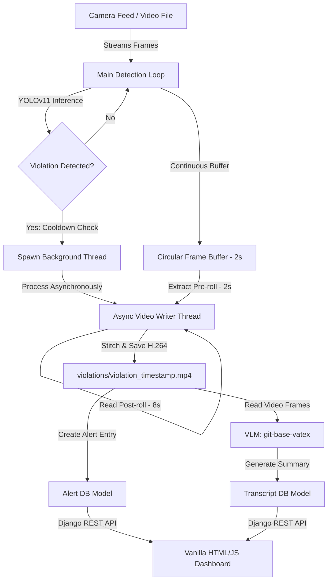

# 🚧 Surveillance AI: Project Learning Blueprint & System Architecture

This document serves as a comprehensive reference guide for understanding, explaining, and refactoring the **Surveillance AI** project. Any LLM/Chatbot reading this file will immediately understand the architecture, database schema, ML pipelines, API design, and routing mechanisms of the project.

---

## 📌 Project Overview
**Surveillance AI** is a real-time safety monitoring and compliance enforcement platform designed for industrial and construction environments. 
It operates as an intelligent pipeline that:
1. **Detects** safety compliance violations (e.g., workers without hardhats, vests, or masks) in real time using a custom fine-tuned **YOLOv11** model.
2. **Records** violation clips asynchronously using a **circular frame buffer** (with a 2-second pre-roll and 8-second post-roll) to ensure the live video feed does not drop frames during disk writes.
3. **Summarizes** the incident using Hugging Face's `microsoft/git-base-vatex` **Vision-Language Model (VLM)** by processing sample frames from the violation video.
4. **Delivers** alerts and descriptions to safety managers via a **Django-based REST API** and a web dashboard.

---

## 🛠️ Technical Stack
* **Web Framework**: Django 5.2 (Python)
* **API Development**: Django REST Framework (DRF)
* **Database**: PostgreSQL (configured for local instance `ai_alerts_db`)
* **Computer Vision & Object Detection**: Ultralytics YOLOv11 (custom model weights)
* **Vision-Language Processing**: PyTorch, Hugging Face Transformers (`microsoft/git-base-vatex`)
* **Video/Image Processing**: OpenCV (OpenCV-Python), Pillow (PIL)
* **Asynchronous Execution**: Native Python threading
* **Frontend**: HTML5, Vanilla CSS3 (with custom CSS variables), Vanilla JavaScript (using async/fetch API)

---

## 📂 Project Structure & File Roles

Below is the directory mapping of the project and the role of each file:

```text
SurveillanceAi/
├── data.yaml                  # YOLOv11 dataset class configuration & train/val/test splits
├── yolo11n.pt / yolo11s.pt   # Pretrained YOLOv11 base weights
├── dataset/                   # Folder housing image/label datasets (train, val, test)
├── runs/                      # YOLO training runs and custom fine-tuned weights
└── ai_alerts/                 # Django Project Root
    ├── manage.py              # Django project manager CLI
    ├── alertsite/             # Project-level Django configuration
    │   ├── __init__.py
    │   ├── asgi.py            # ASGI entry point for async server
    │   ├── wsgi.py            # WSGI entry point for web server
    │   ├── settings.py        # Django project configuration (Database, App definition)
    │   └── urls.py            # Root URL routing configuration
    ├── templates/             # HTML Templates directory
    │   └── dashboard.html     # HTML layout for the Safety Manager dashboard
    ├── static/                # Static assets
    │   ├── css/
    │   │   └── styles.css     # Dashboard custom stylesheets (glassmorphism/layout)
    │   └── js/
    │       └── scripts.js     # AJAX polling, API data merging, and DOM manipulation
    ├── violations/            # Media directory containing saved violation video clips (.mp4)
    └── alerts/                # Main Django App
        ├── __init__.py
        ├── apps.py            # AppConfig setting for django
        ├── admin.py           # Admin panel registrations
        ├── models.py          # Database Schemas (Alert, Transcript)
        ├── serializers.py     # Serializers mapping models to JSON structure
        ├── views.py           # Controller logic (API ViewSets and template views)
        ├── urls.py            # App-level routing and view bindings
        ├── transcript.py      # VLM inference script (Git-base-vatex model)
        └── scripts/
            └── cam.py         # Main multithreaded YOLOv11 camera processing runner
```

---

## 🔄 Core Pipeline & Architecture Flow

The system architecture flows as a linear, event-driven pipeline:



### 1. The Video Stream & Detection Loop (`alerts/scripts/cam.py`)
- Standard OpenCV reads frames sequentially from a video file or live camera stream.
- Each frame is copied and pushed into a **circular buffer** (`collections.deque` with `maxlen = fps * 2`), retaining a continuous 2-second history.
- The frame is passed through a custom YOLOv11 model (`best.pt`).
- If one of the violation classes (`NO-Hardhat`, `NO-Safety Vest`, `NO-Mask`) is detected, the system triggers the logging workflow.

### 2. The Asynchronous Logging Thread
- To prevent disk I/O operations from blocking the live stream (which causes lags and frame drops), a background thread is spawned using Python's `threading.Thread`.
- The thread takes the 2-second pre-roll from the deque and captures the next 8 seconds of post-violation frames.
- It encodes them into an MP4 video using the H.264/AVC codec (`avc1`).
- The saved video is registered as a new `Alert` entry in the database.

### 3. Vision-Language Model Analysis (`alerts/transcript.py`)
- Once the video is written to disk, the VLM (`microsoft/git-base-vatex`) is called.
- The video is opened via OpenCV, and `30` evenly spaced frames are sampled.
- Each frame is converted to an image and run through the VLM to produce a text caption (e.g. "a man working without a helmet").
- A `collections.Counter` aggregates these captions, finds the most frequent observations, and generates a cohesive summary stored in the `Transcript` model.

### 4. API Layer (`alerts/views.py` & `alerts/serializers.py`)
- Django REST Framework exposes model endpoints:
  - `/api/alerts/` returns lists of violations, their timestamps, cameras, and video URLs.
  - `/api/transcripts/` returns the mapping of alert IDs to their generated descriptions.
- The frontend fetches these endpoints and renders them onto the dashboard.

---

## 🗄️ Database Schemas (`alerts/models.py`)

The application models are built on PostgreSQL using two tables:

### 1. `Alert` Model
Represents a recorded safety violation event.
* **`timestamp`** (`DateTimeField`): Automatic timestamp of when the violation occurred.
* **`violations`** (`TextField`): A comma-separated string storing the violation categories detected (e.g. `"NO-Hardhat, NO-Safety Vest"`).
* **`camera_id`** (`CharField`): Identifier for the originating stream (default: `"Camera_1"`).
* **`video`** (`FileField`): File path pointing to the saved video file in `violations/`.

### 2. `Transcript` Model
Holds the AI-generated descriptive summary of the violation event.
* **`alert`** (`ForeignKey` pointing to `Alert`, `on_delete=models.CASCADE`): One-to-many relationship mapping the description back to the safety alert.
* **`timestamp`** (`DateTimeField`): Time of summary creation.
* **`summary`** (`TextField`): Text summary of the event generated by the VLM.

---

## ✅ Completed Refactorings & Architectural Enhancements
The following architectural, code quality, and performance limitations have been fully resolved:

### ⚙️ 1. Code Bug: Fixed `Transcript.__str__`
* **File**: `alerts/models.py`
* **Status**: Resolved. Added string representations to `Alert` and corrected `Transcript.__str__` to point to the parent alert's properties through the foreign key relationship rather than throwing an `AttributeError`.

### 🏎️ 2. Performance: Lazy VLM Model Initialization
* **File**: `alerts/transcript.py`
* **Status**: Resolved. Refactored Hugging Face Transformers initialization to load the `git-base-vatex` model and processor lazily inside a singleton-like `load_vlm()` function. This prevents severe startup lags for standard Django operations (like migration, runserver, testing).

### 🔗 3. URL Routing: Unified Endpoint Consolidations
* **Files**: `alertsite/urls.py` and `alerts/urls.py`
* **Status**: Resolved. Cleaned up root URL routes by deleting the duplicate `DefaultRouter()` mapping in `alertsite/urls.py` and routing all viewsets (`AlertViewSet` and `TranscriptViewSet`) through the app-level `alerts/urls.py` router.

### 📉 4. Network Overhead: Nested Serialization for Alerts
* **Files**: `serializers.py`, `views.py`, and `static/js/scripts.js`
* **Status**: Resolved. Added a SerializerMethodField `summary` to the `AlertSerializer` which fetches the associated transcript summary on the backend. This enables a single-query fetch `/api/alerts/` on the frontend, eliminating network N+1 requests and client-side memory joins.

### 📂 5. Portability: Dynamic Relative Path Fallbacks
* **File**: `alerts/scripts/cam.py`
* **Status**: Resolved. Replaced hardcoded machine-specific absolute directories with dynamic directory resolution (using the script's `__file__` location to compute `project_root` and `django_root`). It looks for local assets first and falls back to absolute local paths only if local copies are missing.

---

## 💬 Guideline for Prompting Chatbots using this File
When pasting this context into any chatbot:
1. **Instruct the chatbot**: *"I am working on the Surveillance AI project described in learning.md. Refer to learning.md for the overall design, database models, and resolved architectural patterns."*
2. **Paste files sequentially**: Start with `alerts/models.py`, followed by `alerts/views.py`, `alertsite/urls.py`, and `alerts/scripts/cam.py` to get help with specific features.
